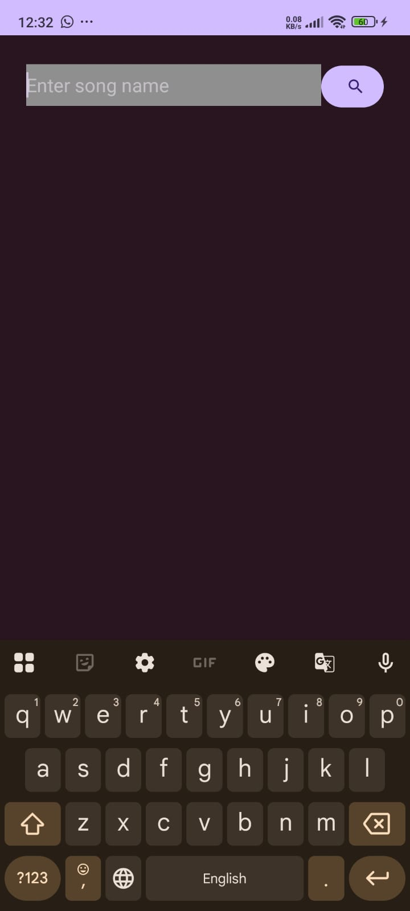
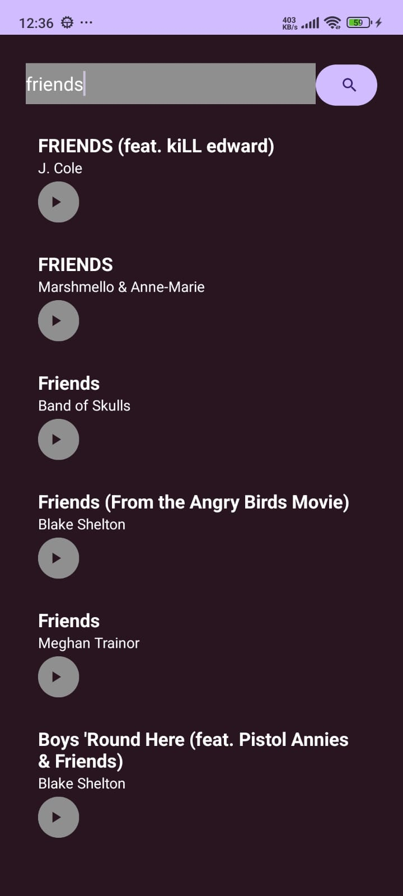

# 🎵 Kotlin Music Player App

A beautiful and lightweight music search and player Android app built using **Kotlin** and **Retrofit**.  
Search for any song using the **iTunes API**, and instantly play a 30-second preview inside the app.

## 📱 App Features

- 🔍 Search for songs by name or artist
- 🧾 Scrollable list using RecyclerView
- ▶️ Stream 30-second music previews
- 🎧 MediaPlayer integration for smooth playback
- 🎨 Clean and minimal Material UI

## 🚀 Technologies Used

- Kotlin
- Android Studio
- Retrofit (for API calls)
- RecyclerView
- MediaPlayer
- iTunes Search API

## 🖼️ Screenshots

> Add these screenshots in a `screenshots/` folder and update the image file names if needed.

